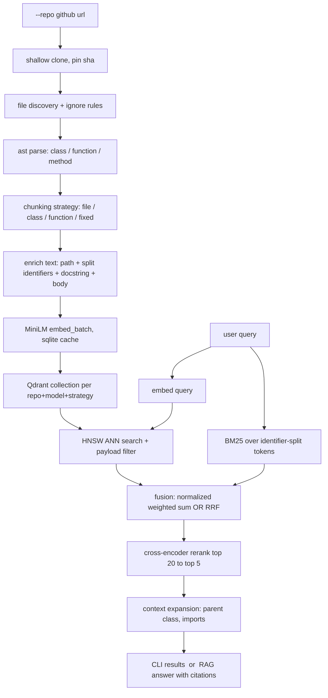
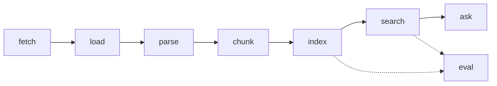

# CodeLens — a semantic code search engine, built from parts

A CLI that clones any GitHub repository, parses it into symbols, embeds them,
indexes them in Qdrant, and answers questions about the code with cited
sources. No LangChain, no LlamaIndex, no vector-store wrapper library — every
stage is hand-written so that every stage can be measured.

This is a learning project, and the thing it is trying to teach is *evaluation*.
Building retrieval is a weekend. Knowing whether your change made it better is
the actual discipline, so there is a 32-query graded gold set, a metrics
harness, seven experiments run across two corpora, and a page documenting
everything that does not work.

Several of the results contradict what the plan predicted. Those are kept.

## What it does

```bash
$ python -m src.cli ask "how are point ids generated so re-indexing does not duplicate rows"

**Claim:** Point IDs are generated using a UUID derived from the `chunk_id`
using `uuid.uuid5(uuid.NAMESPACE_URL, chunk_id)`.

**File:** OpsSense/src/ingestion/indexer.py
**Class/Function:** `_point_id`

sources:
  [1] 0.4623  OpsSense/src/ingestion/indexer.py:12-13  function _point_id
  [2] 0.4203  OpsSense/src/ingestion/indexer.py:16-51  function index_chunks
  ...
citations: ok - 1 grounded
ollama/llama3.2, 3791 prompt chars, retrieval 5ms, generation 3512ms
```

BM25 scores 0.00 on that query. There is no lexical path from "point ids… do
not duplicate rows" to a function called `_point_id`.

## Pipeline



Each stage is a subcommand, so you can stop at any of them and look:



## Quickstart

```bash
python -m venv .venv && source .venv/bin/activate
pip install -r requirements.txt
docker compose up -d                      # Qdrant on :6333

python -m src.cli fetch                   # shallow clone, pinned SHA
python -m src.cli index                   # ~22s cold, 0.5s warm
python -m src.cli search "where do we normalize service names"
python -m src.cli eval                    # score every retriever

# answers need a model; the extractive provider needs nothing
python -m src.cli ask "how are chunks embedded" --llm-provider extractive
ollama serve & python -m src.cli ask "how are chunks embedded"
```

Point it at any repo with `--repo https://github.com/owner/name`. Everything
is config-driven: one `src/config.py` dataclass, every field overridable by a
CLI flag, so each experiment is a flag change rather than a forked pipeline.

## Headline results

OpsSense, function chunking, k=5, 32-query graded gold set.

| retriever | ndcg@5 | what it is |
| --- | --- | --- |
| random | 0.01 | the floor |
| grep | 0.14 | substring matching |
| bm25 | 0.28 | lexical, with an identifier-splitting tokenizer |
| **vector** | **0.56** | MiniLM embeddings + HNSW |
| hybrid_rrf | 0.45 | reciprocal rank fusion of the two |
| vector_rerank | 0.33 | cross-encoder over the top 20 |

**Embeddings beat grep 4x**, which is the result that justifies the whole
vector half of the project. It replicates on the second corpus (httpx: 0.12 →
0.48).

Three results that contradicted expectations, all kept:

- **RRF fusion is worse than pure vector** (0.45 vs 0.56). RRF weights a weak
  arm equally with a strong one. It does buy something real though — it is the
  only retriever with zero false confidence. [docs/11](docs/11-keyword-and-hybrid.md)
- **Cross-encoder reranking makes code search worse** (0.56 → 0.33) while
  helping prose queries. The gold set's `kind` tags turned that hand-wave into
  a tested hypothesis. [docs/12](docs/12-reranking.md)
- **The code-trained embedding model won on one corpus and lost on the other.**
  This is the entire argument for evaluating on two corpora.
  [docs/14](docs/14-experiments.md)

And one that matters more than any of them: **there is no usable similarity
threshold.** Irrelevant results have a 75th-percentile score of 0.430;
relevant results have a median of 0.416. The distributions overlap, so
"abstain below T" cannot be implemented honestly.
[docs/17](docs/17-failure-cases.md)

## The vector-database half

Synthetic benchmarks, dim 384, measured against Qdrant's exact search as
ground truth. Full tables in [docs/16](docs/16-ann-performance.md).

| points | build | p50 query | exact p50 | disk |
| --- | --- | --- | --- | --- |
| 1,000 | 0.7s | 1.68ms | 1.46ms | 4.9MB |
| 10,000 | 4.7s | 2.09ms | 1.78ms | 49.8MB |
| 100,000 | 72.4s | 2.52ms | 5.21ms | 242.6MB |

Below 100k points, **brute force is faster than the ANN index**. The graph
traversal costs more than scanning the vectors.

The recall-versus-speed curve at 10k points, `ef_search` swept:

| ef_search | 4 | 16 | 64 | 256 | 512 |
| --- | --- | --- | --- | --- | --- |
| recall@10, random vectors | 0.114 | 0.182 | 0.460 | 0.872 | 0.974 |
| recall@10, real embeddings | **1.000** | 1.000 | 1.000 | 1.000 | 1.000 |

Random vectors in 384 dimensions are nearly equidistant — the worst case a
proximity graph can be handed. Real embeddings cluster, so HNSW finds
everything at `ef_search=4`. **Tune ANN parameters against your own data or
you will tune them against the wrong curve.**

## Generation, and what the citation check is worth

`ask` formats the retrieved chunks as numbered blocks headed by
`path:start-end`, sends a prompt that forbids inventing implementation details
and requires an explicit "the context is insufficient", then **validates every
citation in the answer against the set that was actually retrieved**.

An ablation against a naive prompt, seven questions, same retrieval:

| prompt | abstained on unanswerable | invented citations |
| --- | --- | --- |
| project | **3 / 3** | 0 / 7 |
| naive | 0 / 3 | 0 / 7 |

Neither prompt invented a citation, and that does not mean neither
hallucinated: asked for a Kubernetes manifest the repo does not contain, the
naive prompt wrote one from scratch, cited nothing, and therefore *passed* the
citation check. Citation validation catches invented references, not invented
content. [docs/15](docs/15-rag-and-citations.md)

## Documentation

Written as the project was built, one page per stage. The order is the order
the decisions were made in.

| | |
| --- | --- |
| [01](docs/01-vector-databases.md) | Vector databases, and why Qdrant instead of a numpy array |
| [02](docs/02-repo-fetching.md) | Fetching a repo, and why the commit SHA is not optional |
| [03](docs/03-file-discovery.md) | File discovery: what gets indexed and what does not |
| [04](docs/04-parsing-and-chunking.md) | Parsing and chunking: what a "unit of retrieval" is |
| [06](docs/06-embeddings-and-caching.md) | Embeddings, and the cache that makes experiments affordable |
| [07](docs/07-indexing-and-idempotency.md) | Indexing: collections, stable IDs, and the delete nobody writes |
| [08](docs/08-vector-search.md) | Vector search: HNSW, exact search, and reading the scores |
| [09](docs/09-metadata-filters.md) | Metadata filters: why Qdrant does this and a numpy array cannot |
| [10](docs/10-metrics.md) | Metrics: measuring retrieval instead of eyeballing it |
| [11](docs/11-keyword-and-hybrid.md) | BM25, fusion, and the result that contradicted the plan |
| [12](docs/12-reranking.md) | Cross-encoder reranking, and the experiment that said no |
| [13](docs/13-context-and-diversity.md) | Context expansion and stopping the list repeating itself |
| [14](docs/14-experiments.md) | Seven experiments, two corpora, and which conclusions survived |
| [15](docs/15-rag-and-citations.md) | Answer generation, and checking the citations afterwards |
| [16](docs/16-ann-performance.md) | HNSW: the recall-versus-speed curve |
| [17](docs/17-failure-cases.md) | Where it fails, and why retrieval is probabilistic |

Generated result tables live in [`docs/experiments/`](docs/experiments/).
(There is no `05`: parsing and chunking stayed one page.)

## Commands

| command | what it does |
| --- | --- |
| `fetch` | shallow clone into `.repos/<owner>__<name>@<sha>/` |
| `load` | file discovery with ignore rules, per-language counts |
| `parse` | `ast` and markdown heading parse into symbols |
| `chunk` | chunk and report token stats; `--stats` compares all four strategies |
| `index` | embed and *sync* into Qdrant — upsert changed, delete orphans |
| `search` | vector search, with `--rerank --mmr --expand --exact` and metadata filters |
| `ask` | retrieve, generate, validate citations; `--show-prompt` to see the input |
| `eval` | score every retriever against the gold set, dump per-query JSON |

Plus `python -m scripts.experiments.run_all` for the seven experiments,
`python -m scripts.bench all` for the ANN benchmarks, and
`python -m scripts.rag_probe` for the generation probe.

## Design decisions worth knowing about

- **Indexing is a sync, not an append.** Point IDs are `uuid5` over
  `path:class:symbol:start_line:strategy`, payloads carry a content hash, and
  points absent from the current parse are **deleted**. That last half is the
  one everyone skips, and it is why search after a refactor returns functions
  that no longer exist. [docs/07](docs/07-indexing-and-idempotency.md)
- **A warm reindex never imports torch.** The collection is created *after*
  embedding so its dimension comes from the vectors. A fully-cached rebuild
  went from 8.2s to 0.2s.
- **Two texts per chunk.** `text` is verbatim source for display and citation;
  `embed_text` is path + split identifiers + docstring + body. Identifier
  splitting (`_shouldRetry` → `should`, `retry`, `shouldretry`) is the core
  lesson of running BM25 over code.
- **A sqlite embedding cache** keyed by `sha256(model + text)`. Without it,
  four chunking strategies against three models on CPU is unaffordable, and
  every experiment in this repo depends on it.
- **The whole test suite runs without Docker or torch**, via Qdrant's
  `:memory:` local mode and injectable `encode`/`score_pairs` functions.

## Layout

```
src/
  config.py              single source of tunables
  cli.py                 argparse subcommands (stdlib, no click/typer)
  parser/                repo_fetcher, repository_loader, code_parser
  chunking/code_chunker  4 strategies, one Chunk dataclass
  embeddings/            embedder + sqlite cache
  vector_store/          qdrant_store: sync, filters, search
  retrieval/             vector_search, keyword_search, fusion, reranker, context
  rag/                   llm providers, generator, citation validation
  eval/                  gold set loading, metrics, harness
eval/                    opssense.json, httpx.json, per-query results
docs/                    one page per stage
scripts/                 experiments, benchmarks, probes
tests/                   110 tests, no network, no GPU
```

## Status

Milestones 1-6 complete. Known gaps:

- `eval/httpx.json` is agent-written and **not human-reviewed**. Every httpx
  number inherits that caveat.
- Corpora are small (85 and 1,465 chunks), so per-query deltas are reported
  alongside means throughout.
- The most promising unexplored direction is LLM query expansion before
  retrieval, which would plausibly fix the synonym failures in
  [docs/17](docs/17-failure-cases.md).
